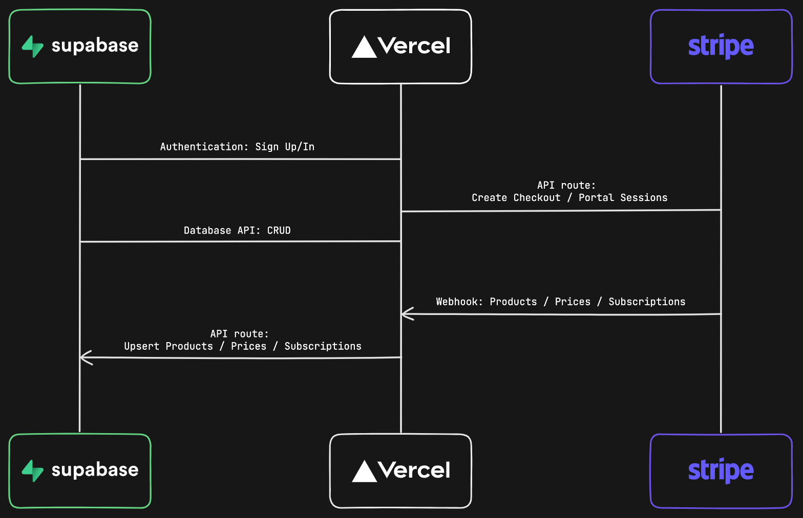

# Next.js, FastAPI, Material UI & React Query Starter

## Características

- Gestión de usuarios y autenticación con FastAPI.
- Interfaz de usuario moderna y responsiva con Material UI.
- Gestión de estado y caché de datos con React Query.
- Integración con Stripe Checkout y el portal de clientes de Stripe.
- Sincronización automática de planes de precios y estados de suscripción a través de webhooks de Stripe.

## Arquitectura



## Configuración Paso a Paso

Para poner en marcha este proyecto, sigue los siguientes pasos:

### 1. Configuración del Backend (FastAPI)

Consulta el directorio `fastapi_backend` para las instrucciones de configuración y ejecución del backend. Asegúrate de que el backend esté funcionando y accesible.

### 2. Configuración de Variables de Entorno

Copia el archivo `.env.local.example` a `.env.local` y `.env.example` a `.env` en la raíz del proyecto `sass_front` y configura las siguientes variables:

```
NEXT_PUBLIC_API_BASE_URL=http://localhost:8001/api/v1
NEXT_PUBLIC_STRIPE_PUBLISHABLE_KEY=
STRIPE_SECRET_KEY=
STRIPE_WEBHOOK_SECRET=
```

*   `NEXT_PUBLIC_API_BASE_URL`: URL base de tu API de FastAPI.
*   `NEXT_PUBLIC_STRIPE_PUBLISHABLE_KEY`: Tu clave publicable de Stripe (modo de prueba).
*   `STRIPE_SECRET_KEY`: Tu clave secreta de Stripe (modo de prueba).
*   `STRIPE_WEBHOOK_SECRET`: Secreto de tu webhook de Stripe.

### 3. Instalación de Dependencias

Navega al directorio `sass_front` e instala las dependencias. Asegúrate de tener `npm` o `pnpm` instalado.

```bash
npm install
# o
pnpm install
```

### 4. Configuración de Stripe

Configura Stripe para manejar pagos de prueba. Asegúrate de tener el "Modo de Prueba" activado en tu panel de Stripe.

#### Crear un Webhook

Necesitamos crear un webhook en la sección `Developers` de Stripe. Este webhook conecta Stripe con tu backend de FastAPI.

1.  Haz clic en "Add Endpoint" en la página de [Endpoints de prueba](https://dashboard.stripe.com/test/webhooks).
2.  Introduce la URL de tu endpoint de webhook de FastAPI (ej. `http://localhost:8001/api/v1/webhooks/stripe`).
3.  Selecciona los eventos relevantes para escuchar (ej. `product.*`, `price.*`, `checkout.session.completed`, `customer.subscription.*`).
4.  Copia el `Signing secret` (ej. `whsec_xxx`) ya que lo necesitarás para `STRIPE_WEBHOOK_SECRET` en tu `.env.local`.

#### Crear productos y precios

Crea tus productos y precios en el [Panel de Stripe](https://dashboard.stripe.com/test/products). Tu backend de FastAPI escuchará las actualizaciones de productos a través del webhook.

### 5. Ejecutar el Cliente Next.js

En una terminal separada, ejecuta el siguiente comando para iniciar el servidor de desarrollo:

```bash
npm run dev
# o
pnpm dev
```

Finalmente, navega a [http://localhost:3000](http://localhost:3000) en tu navegador para ver la aplicación.

## Ir a Producción

### Configurar variables de entorno de producción

Para ejecutar el proyecto en modo real y procesar pagos con Stripe, cambia Stripe de "modo de prueba" a "modo de producción". Tus claves API de Stripe serán diferentes en modo de producción, y tendrás que crear un webhook de producción separado. Copia estos valores y pégalos en tus variables de entorno de producción.

### Desplegar

Después de configurar las variables de entorno de producción, despliega tu aplicación. Asegúrate de que todos los servicios (FastAPI backend, Next.js frontend) estén configurados correctamente para producción.